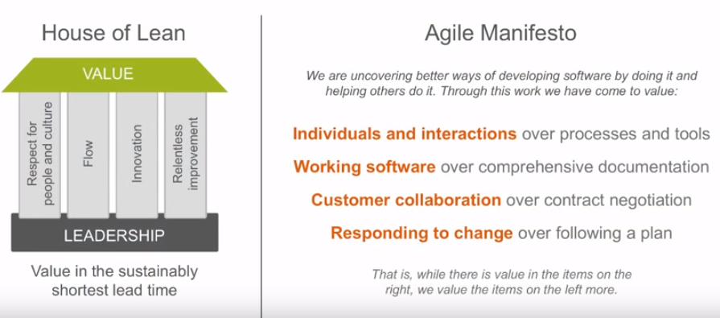
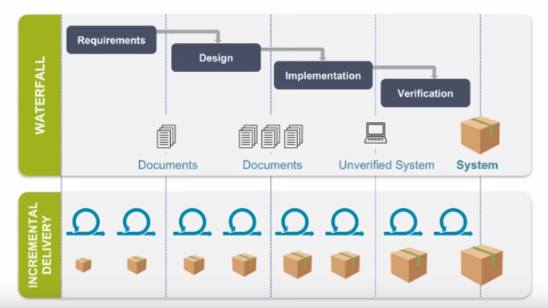
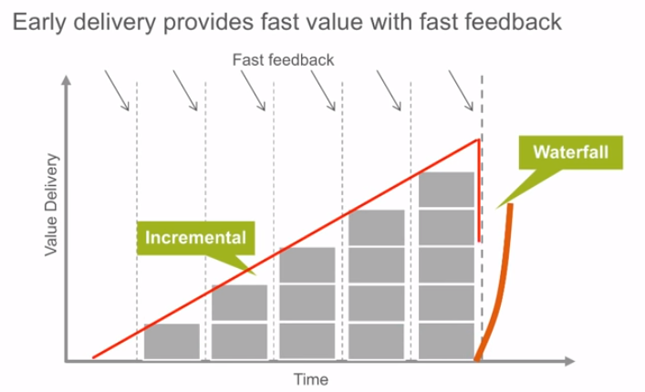
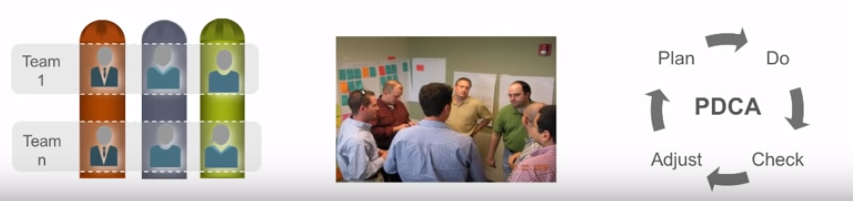
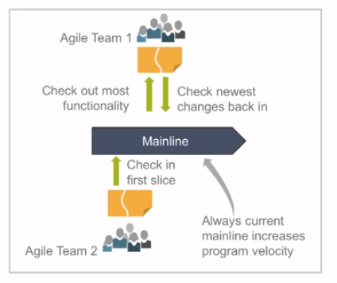
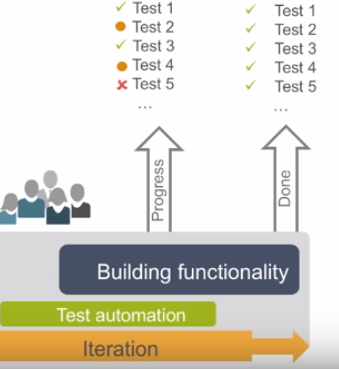
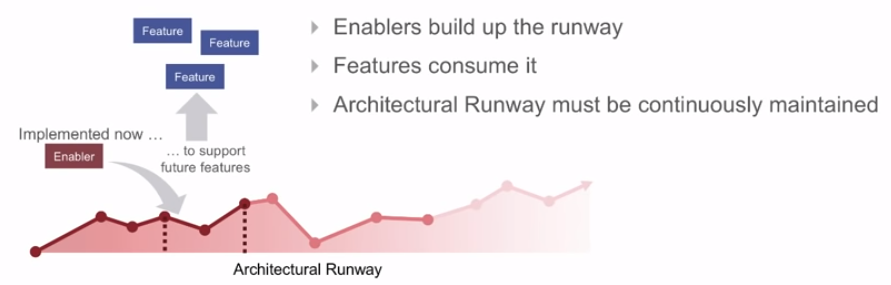
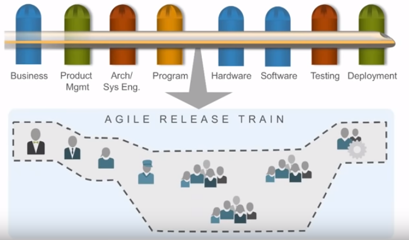
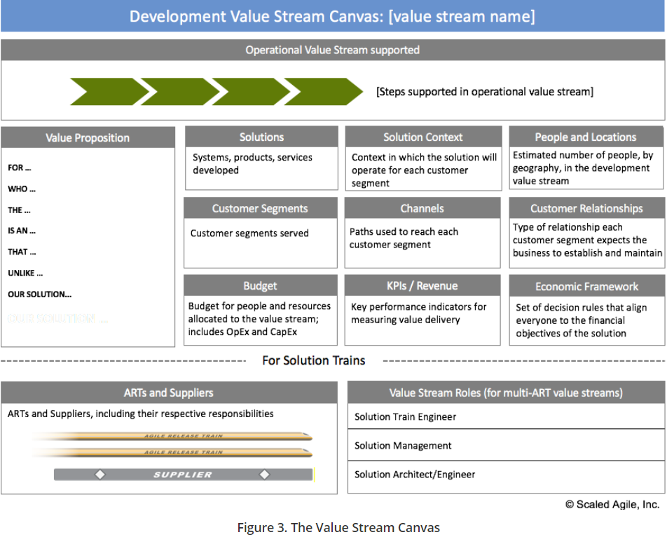
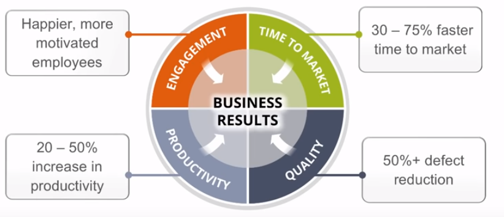

# Leading SAFe 
+ From Dean Leffingwell, creator of SAFe high-level overview of Scaled Agile

## Review the case studies
+ Lean Agile mindset
+ Retrospectives read like this:
    + No way to improve systematically
    + Too little visibility
    + Under-estimated dependencies
    + Massive growth in complexity
    + Too early commitment to a design that didn't work
    + Hard to manage distributed teams
    + Late delivery
    + Phase gate SDLC isn't helping reduce risk
    + Problems discovered too late
    + Poor morale
+ Management's challenge
    + _It is not enough that management commit themselves to quality and productivity...They must know what it is they must do. Such a responsibility cannot be delegated._
    _--W. Edwards Deming_
+ " _and if you can't come, send no one" - Vignette from Out of the Crisis, Deming 1986_

## What it is they _must_ do?
+ Embrace a Lean-Agile mindset
+ Implement Lean-Agile practices
+ Lead the implementation
+ Get results

### Embrace Lean-Agile value
+ House of Lean
+ Agile Manifesto   

### SAFe Lean-Agile Principles
1. Take an economic view
1. Apply system thinking
1. Assume variability; preserve options
1. Build incrementally with fast, integrated learning cycles
1. Base milestones on objective evaluation of working systems
1. Visualize and limit WIP, Reduce batch sizes, and manage queue lengths
1. Apply cadence, synchronize with cross-domain planning
1. Unlock the intrinsic motivation of knowledge workers
1. Decentralize decision-making

### Building incrementally accelerated value and delivery

### Agile delivers better economics 

### Review the level of SAFE website
https://www.scaledagileframework.com/

### Agile Teams
+ Cross-functional, self-orgainizng entities that can **define**, **build** and **test** a value stream
+ Apply basic scientific practices: Plan - Do - Check - Adjust   

### Integrate frequently
+ Integration points control product development
+ Avoid physical branching for software
+ Frequently integrate hardware branches
+ Use development by intention in inter-team dependencies

### Apply test automation
+ Test automation supports rapid regression testing
+ Implement testing in the same iteration
+ Maintained under version control
+ **Passing** vs. **Not-yet-passing** and *broken automated tests* are the *real* iteration progress indicator   

### Agile Release Train
+ Align 50-125 practitioners to a *common* mission
+ Apply cadence and synchronization across the agile teams, Program Increments every 8-12 weeks
+ Provide Vision, Roadmap, architecture guidance

### Architecture Runway
+ Architecture Runway - existing code, hardware components, etc. that technically enable near-term business features
    + Enablers build up the runway
    + Features consume it
    + Architectural Runway must be continuously maintained
    + Enablers extend the runway   

### ART takes a System View
+ Cross-functional virtual team   

### Syncrhonized on PI Planning   
+ All stakeholders should be face-to-face 
+ Management sets the mission, with minimum possible constraints
+ Requirements and design emerge
+ Important stakeholders decisions are accelerated
+ Teams create and take the responsiblity for the **plans**   

### Demonstrate the full-system every two weeks
+ An integrated solution demo
+ Objective milestone
+ Demo from the staging environment or near proxy

### Inspect and Adapt every PI
+ Every PI, teams systematically address the larger impediments that are limiting velocity
    + Agree on the problem to solve
    + Apply root cause analysis
    + Identify the biggest root cause, using Pareto Analysis
    + Restate the new problem for the biggest root cause
    + Brainstorm solutions 

### Build a Portfolio organized around Value
+ Identify and organize around Value Streams
+ Communicate enterprise strategy with Strategic Themes
+ Empower decision makers with Lean-Agile Budgeting
+ Provide visibility and governance to cross-cutting initiatves with Kanban

### Value Stream level
+ Identify value streams 
+ Establish cadence and synchronization
+ Define stream boundaries, people, deliverables, ARTs
+ Capture a Value Stream Canvas   

   

### Leadership Foundation
+ _People are already doing their best; the problems are with the system. Only management can change the system._    

     _--W. Edwards Deming_

### Business Results

